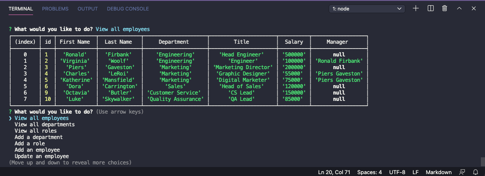

# Employee Tracker 

## Description
Employee Tracker is a CLI that allows the user to easily manage their business, departments, and individual employees. With Employee Tracker, you can add, remove, and edit departments, roles, and employees quickly and easily. 

## Table of Contents

## Installation
To install, you will need the following dependencies: npm mysql, npm inquirer, and npm itself. Once you have the aforementioned dependencies and have clone or forked from my repo, simply type 'npm start' to begin! 

## Usage
Employee Tracker helps Users maintain business data from both macro and micro views, giving the operator the ability to quickly view departmental needs and costs. 

## License
This application is under the MIT license.

## Video & Screenshot
https://drive.google.com/file/d/1s3k9rOBU0MyCrPXW8fEKiSFJMTxTLv6t/view

## Questions
Github: https://www.github.com/clu-codes
If you have additional questions, please feel free to reach out to me on LinkedIn at Connor Cluster.